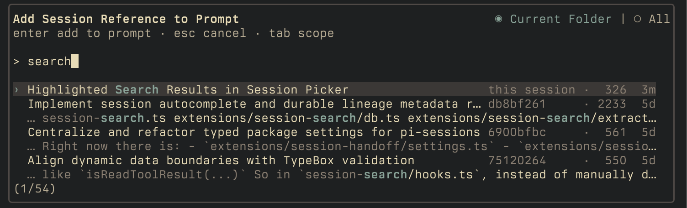
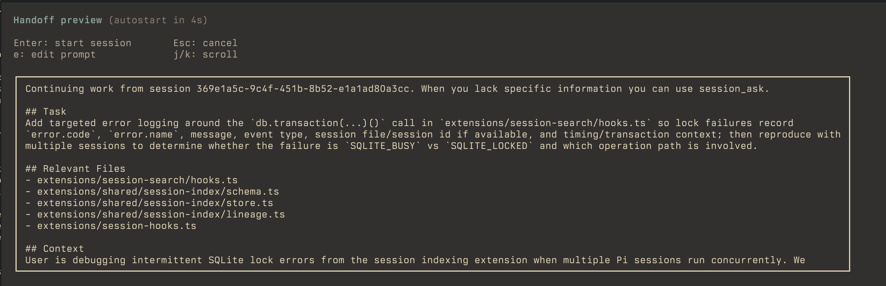
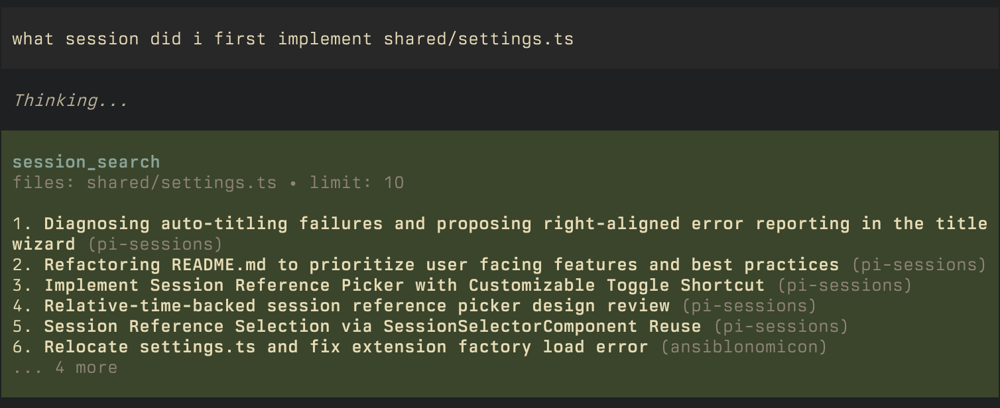
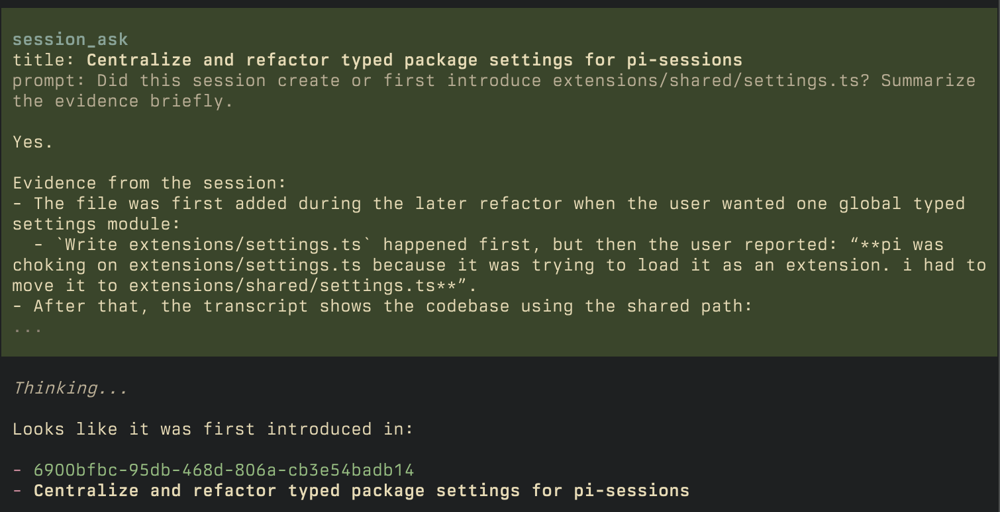
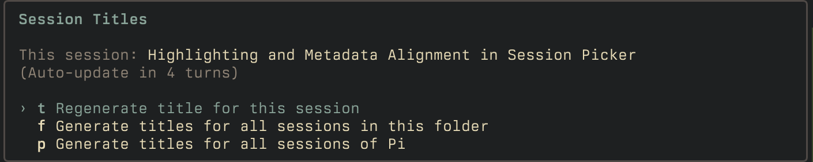

# pi-sessions

`pi-sessions` turns your old Pi sessions into something you can actually reuse. It gives you search, follow-up Q&A, deliberate handoffs into new child sessions, automatic session titles, and a local index that keeps future sessions searchable.

## Screenshots

### Session lookup



### Handoffs



### Ask about old sessions





## Install

**From npm** (recommended):

```bash
pi install npm:pi-sessions
```

If you want to run directly from a local clone while developing:

```bash
pi -e /absolute/path/to/pi-sessions
```

## Quick start

1. Install the package.
2. Open Pi and run `/session-index`.
3. Press `r` to build the index for all your prior sessions.
4. Try the main flows:

```text
What session did I implement the db layer?
```

```text
/handoff i want to implement the frontend component now
```

## Features

| Extension          | Surface                               | What it does                                            |
| ------------------ | ------------------------------------- | ------------------------------------------------------- |
| Session Search     | `session_search` pi tool              | Search through old sessions                             |
| Session Ask        | `session_ask` pi tool                 | Ask questions about old sessions                        |
| Session Handoff    | `/handoff`, session picker shortcut   | Start a focused new session; alternative to compaction  |
| Session Picker     | `Alt+O`                               | Reference old sessions in your prompt                   |
| Session Index      | `/session-index` slash command        | Shows index status and rebuilds the local session index |
| Session Auto Title | in background, `/title` slash command | Give sessions titles                                    |

## Session Handoff

`/handoff <goal>` starts a focused new session. Give pi a goal, and it will generate a prompt for you to review before kicking it off.

You can either start a new session directly in your current one, or if you have Ghostty on macOS, you can spawn a new one in a split-pane and continue in your current:

- `/handoff --left <goal>`
- `/handoff --right <goal>`
- `/handoff --up <goal>`
- `/handoff --down <goal>`

The flag indicates the Ghostty split direction.

Flow:

- run `/handoff [--<direction>] <goal>`
- review the generated prompt preview
- optionally edit the prompt
- start the new session

If you do nothing, the preview autostarts after a short countdown.

## Session picker

Directly reference prior sessions by looking them up by contents.

- shortcut: `Alt+O`
- press `Tab` to switch between current folder and all sessions
- type to filter results
- press `Enter` to insert a session id into your prompt

### Handoff setting

If you want to override the shortcut, put this in your `~/.pi/agent/settings.json`:

```json
{
  "sessions": {
    "handoff": {
      "pickerShortcut": "alt+p"
    }
  }
}
```

## Session Index

By default, `pi-sessions` will start indexing all conversations moving forward. If you want to backfill all prior conversations:

- run `/session-index`
- hit `r` to (re)index everything

this is idempotent, so if you run into any issues, or disable pi-sessions for a while, feel free to re-index to see if that resolves anything.

By default the index lives at:

```text
~/.pi/agent/pi-sessions/index.sqlite
```

but you can change the location in `~/.pi/agent/settings.json`:

```json
{
  "sessions": {
    "index": {
      "dir": "~/.pi/agent/pi-sessions"
    }
  }
}
```

## Session Auto Title

The auto-title extension keeps your session list readable by:

- Setting a title based on initial prompt
- Reevaluating the title every 4 turns to see if it should be updated

To manage existing titles, run `/title`, where you can:

- Regenerate a title for the current session
- Generate titles for all sessions in the folder
- Generate titles for all sessions across pi



Note that generating titles for all sessions can take some time, and will hit your configured model with the full contents of all sessions.

- automatic retitles run every few turns
- if you manually rename a session with `/name`, automatic retitling pauses for that session
- Regenerate the title for the current session to resume automatic retitling
- if unconfigured, it will attempt to use these models in order, first one that is available:
  - `google/gemini-flash-lite-latest`
  - `anthropic/claude-haiku-4-5`
  - `openai/gpt-5.4-mini`
  - your currently configured model

To change auto-titling settings, edit `~/.pi/agent/settings.json`:

```json
{
  "sessions": {
    "autoTitle": {
      "refreshTurns": 4,
      "model": "anthropic/claude-haiku-4-5"
    }
  }
}
```

## Development

```bash
npm install
npm run check
npm test
```

For an end-to-end manual flow, see [SMOKE.md](./SMOKE.md).
