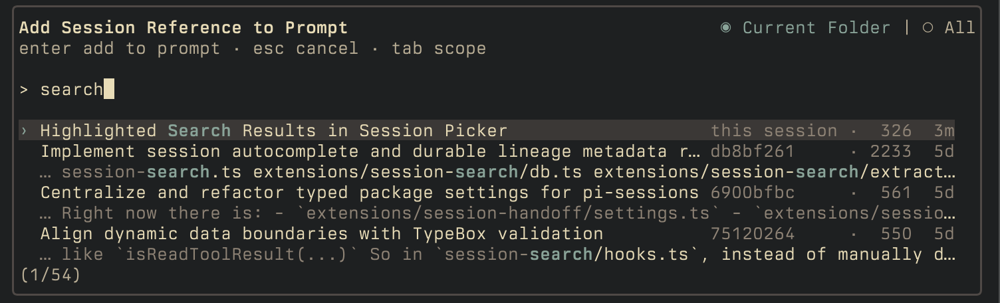
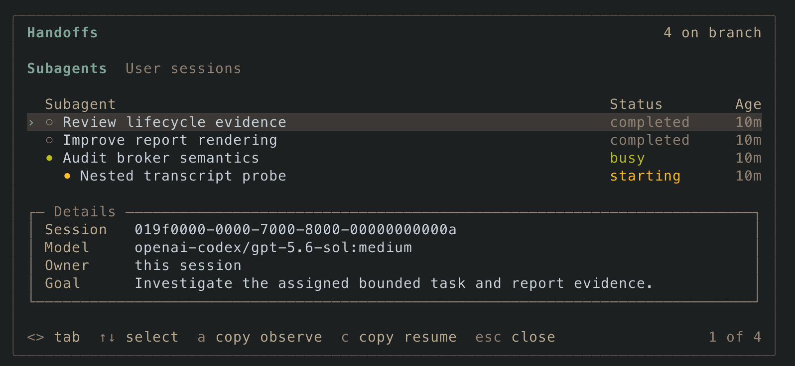
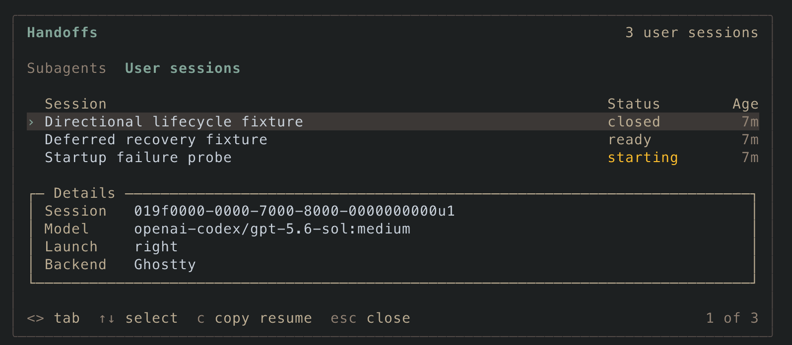
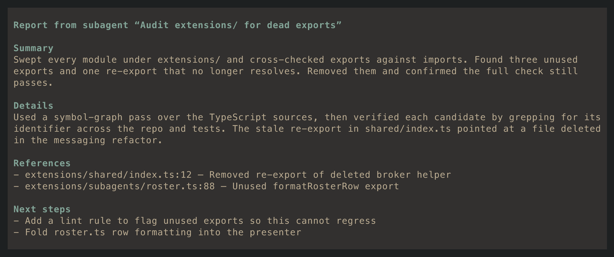
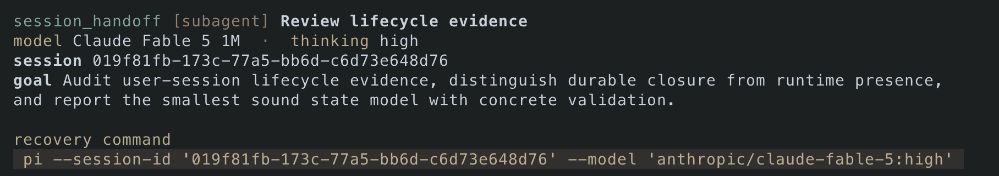
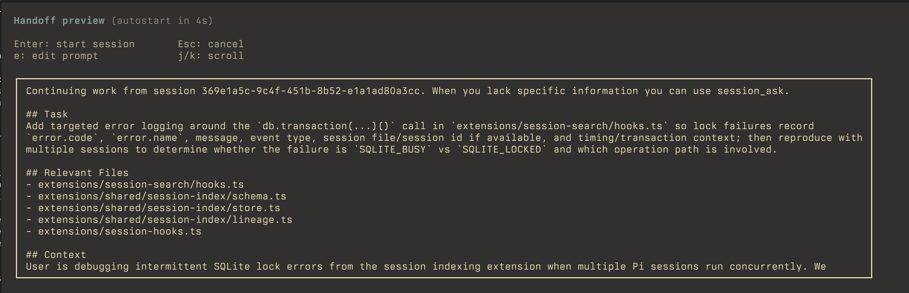
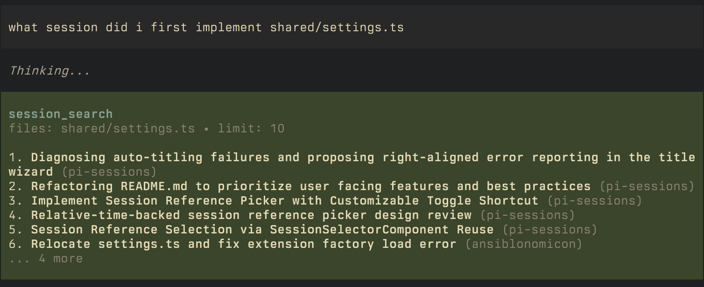
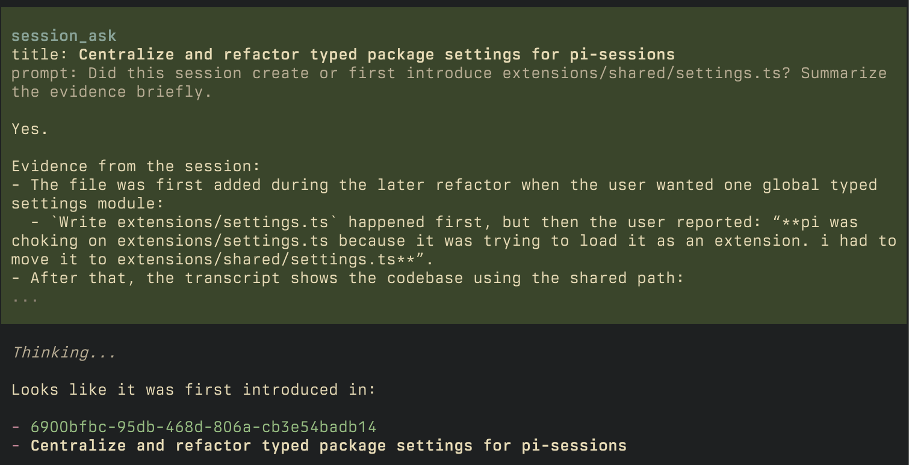
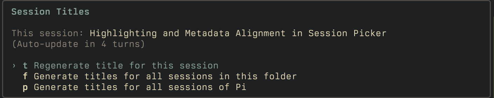

# pi-sessions

`pi-sessions` turns your old Pi sessions into something you can actually reuse. It gives you search, follow-up Q&A, deliberate handoffs into new child sessions, automatic session titles, and a local index that keeps future sessions searchable.

## Screenshots

### Session lookup



### Handoff board





### Subagent report



### Session handoff



### Handoff prompt review



### Ask about old sessions





## Install

Requires Pi `0.82.1` or newer and Node `>=24 <26`.

**From npm** (recommended):

```bash
pi install npm:pi-sessions
```

If you want to run directly from a local clone while developing:

```bash
pi -e /absolute/path/to/pi-sessions
```

## Quick start

1. Install the package.
2. Open Pi and run `/session-index`.
3. Press `r` to build the index for all your prior sessions.
4. Try the main flows:

```text
What session did I implement the db layer?
```

```text
Open the frontend implementation task in a session to the right.
```

## Features

| Extension          | Surface                                                                | What it does                                            |
| ------------------ | ---------------------------------------------------------------------- | ------------------------------------------------------- |
| Session Search     | `session_search` pi tool                                               | Search through old sessions                             |
| Session Ask        | `session_ask` pi tool                                                  | Ask questions about old sessions                        |
| Session Handoff    | `session_handoff` pi tool, `/handoff` board                            | Start and manage focused child sessions                 |
| Session Messaging  | `session_reachable`, `session_send_message`, `session_cancel` pi tools | Coordinate between live Pi sessions and own subagents   |
| Session Picker     | `Alt+O`                                                                | Reference old sessions in your prompt                   |
| Session Index      | `/session-index` slash command                                         | Shows index status and rebuilds the local session index |
| Session Auto Title | in background, `/title` slash command                                  | Give sessions titles                                    |

Every feature is on by default. Turn one off with `enable: false` under its own settings namespace, which unregisters its tools and hooks.

```json
{
  "sessions": {
    "messaging": { "enable": true },
    "subagents": { "enable": true },
    "handoff": { "enable": true },
    "search": { "enable": true },
    "ask": { "enable": true },
    "autoTitle": { "enable": true },
    "hooks": { "enable": true }
  }
}
```

## Session Search

`session_search` searches the local session index by text, repo, cwd, time range, and file evidence.

Queries support regular text for normal usage, quoted phrases, `AND` / `OR` / `NOT`, parentheses, and `-term` negation when matching needs to be stricter. Unquoted terms use prefix matching, quoted terms are exact. A search with no query returns matching sessions chronologically, newest first.

File filters distinguish read-or-write evidence from write-only evidence:

- `files.touched`: sessions that read or changed a path
- `files.changed`: sessions that changed a path

Use `kind: "user"` or `kind: "subagent"` to filter by session type across the whole index. Searching for sessions that can be addressed right now is a different question, answered by `session_reachable`.

## Session Handoff

The `session_handoff` tool lets the agent create a child session with a self-contained task. Ask for a direction when you want a visible split, ask for a deferred handoff when you only want the prepared session, or let the agent delegate suitable independent work to a background subagent.

Directional launches use tmux when the current terminal is inside tmux, or Ghostty on macOS. Deferred launches create the child without starting it and copy its resume command to the clipboard. A background subagent runs in a detached tmux window and reports back when finished; note that subagents are started with `--approve`, meaning pi will always start in the directory as trusted.

Run `/handoff` to open the **Handoffs** board. The Subagents and User sessions tabs show status, age, launch details, and the actions currently available: stop, copy an observation command, or copy a resume command.

## Session Messaging

Agents can coordinate with live Pi sessions and their own subagents:

- `session_reachable` lists the sessions this session can send messages to
- `session_send_message` sends a message to a live session or own subagent
- `session_cancel` aborts another live session's current turn

Incoming messages start the recipient agent when idle and steer it when already running. Messaging a dormant owned subagent resumes it automatically; other inactive sessions cannot receive messages, but you can still use `session_search` and `session_ask` with them.

## Session picker

Directly reference prior sessions by looking them up by contents.

- shortcut: `Alt+O`
- press `Tab` to switch between current folder and all sessions
- type to filter results
- press `Enter` to insert a session id into your prompt

### Handoff setting

If you want to override the shortcut, put this in your `~/.pi/agent/settings.json`:

```json
{
  "sessions": {
    "handoff": {
      "pickerShortcut": "alt+p",
      "model": "openai-codex/gpt-5.6-terra",
      "thinkingLevel": "low",
      "deferred": {
        "copyToClipboard": true
      }
    }
  }
}
```

`model` and `thinkingLevel` configure the agent that builds handoff prompts. They default to the new session's values when absent.

`deferred.copyToClipboard` (default `true`) controls whether deferred handoffs copy the resume command to the clipboard. When off, the resume command is only shown in the tool call.

Subagents require the handoff and messaging features. Limit recursive delegation depth with `sessions.subagents.maxDepth` (default `2`):

```json
{
  "sessions": {
    "subagents": {
      "maxDepth": 2
    }
  }
}
```

## Session Index

By default, `pi-sessions` will start indexing all conversations moving forward. If you want to backfill all prior conversations:

- run `/session-index`
- hit `r` to (re)index everything

this is idempotent, so if you run into any issues, or disable pi-sessions for a while, feel free to re-index to see if that resolves anything.

By default the index lives at:

```text
~/.pi/agent/pi-sessions/index.sqlite
```

but you can change the location in `~/.pi/agent/settings.json`:

```json
{
  "sessions": {
    "index": {
      "dir": "~/.pi/agent/pi-sessions"
    }
  }
}
```

## Session Auto Title

The auto-title extension keeps your session list readable by:

- Setting a title based on initial prompt
- Reevaluating the title every 4 turns to see if it should be updated

To manage existing titles, run `/title`, where you can:

- Regenerate a title for the current session
- Generate titles for all sessions in the folder
- Generate titles for all sessions across pi



Note that generating titles for all sessions can take some time, and will hit your configured model with the full contents of all sessions.

- automatic retitles run every few turns
- if you manually rename a session with `/name`, automatic retitling pauses for that session
- Regenerate the title for the current session to resume automatic retitling
- if unconfigured, it will attempt to use these models in order, first one that is available:
  - `openai-codex/gpt-5.6-luna`
  - `openai/gpt-5.6-luna`
  - `anthropic/claude-haiku-4-5`
  - `google/gemini-flash-lite-latest`
  - your currently configured model

To change auto-titling settings, edit `~/.pi/agent/settings.json`:

```json
{
  "sessions": {
    "autoTitle": {
      "refreshTurns": 4,
      "timeoutSecs": 15,
      "tokenBudget": 64,
      "model": "anthropic/claude-haiku-4-5",
      "thinkingLevel": "off",
      "prompt": "Custom prompt that overrides the default.",
      "persistRuns": false
    }
  }
}
```

`persistRuns` records each title request as its own session file under `~/.pi/agent/pi-sessions/session-auto-title/`, holding the exact prompt and response. Open one with `pi --session <file>` to see what the titling model was sent.

## Development

```bash
mise trust && mise bootstrap
mise run check
mise run test
```

For an end-to-end manual flow, see [SMOKE.md](./SMOKE.md).
