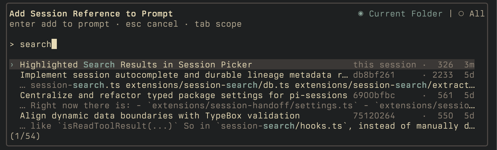
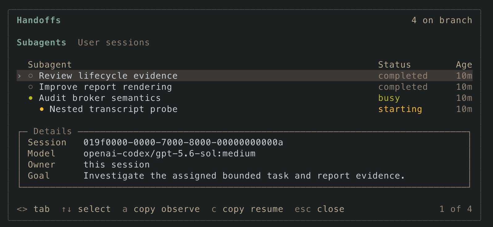
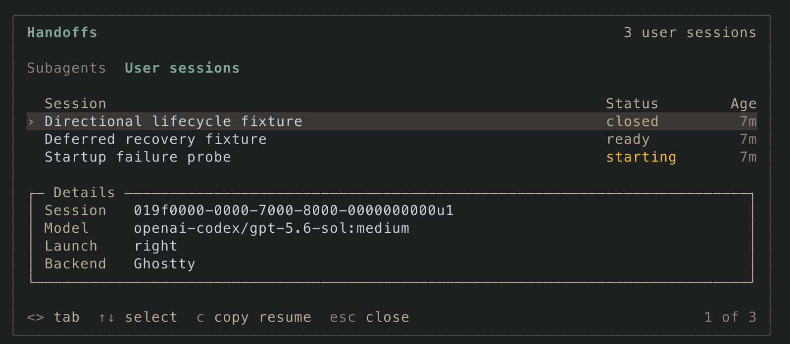
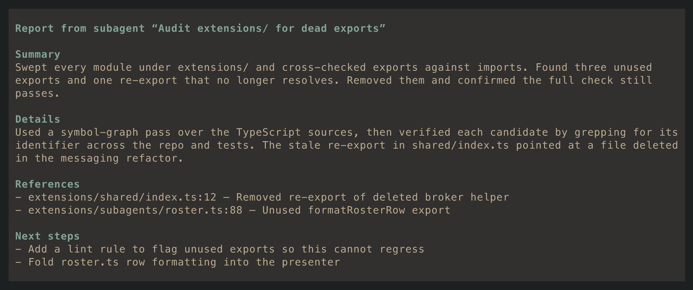
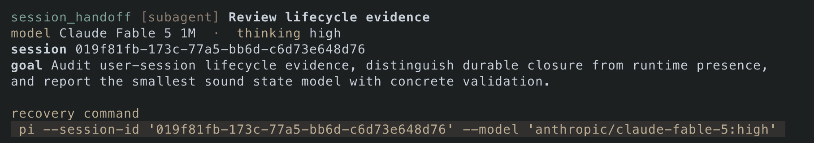
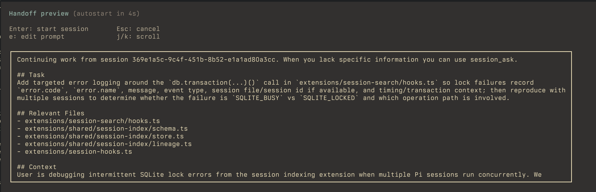
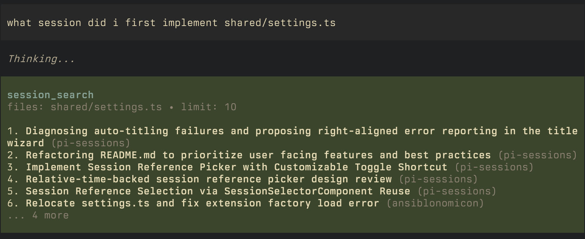
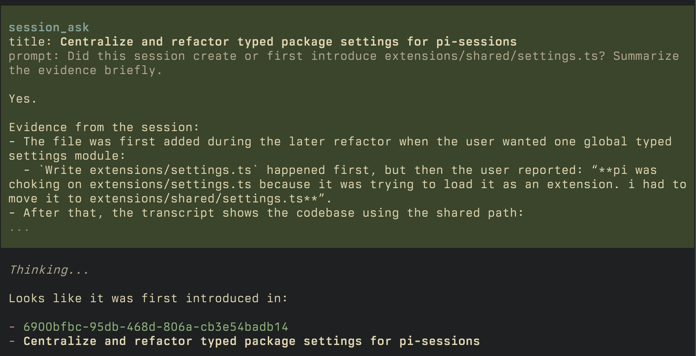
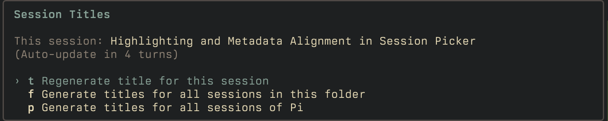

# pi-sessions

`pi-sessions` turns your old Pi sessions into something you can actually reuse. It gives you search, follow-up Q&A, deliberate handoffs into new child sessions, automatic session titles, and a local index that keeps future sessions searchable.

## Screenshots

### Session lookup



### Handoff board





### Subagent report



### Session handoff



### Handoff prompt review



### Ask about old sessions





## Install

Requires Pi `0.99.1` or newer and Node `>=24 <26`.

**From npm** (recommended):

```bash
pi install npm:pi-sessions
```

If you want to run directly from a local clone while developing:

```bash
pi -e /absolute/path/to/pi-sessions
```

## Quick start

1. Install the package.
2. Open Pi. Your prior sessions are indexed automatically in the background.
3. Try the main flows:

```text
What session did I implement the db layer?
```

```text
Open the frontend implementation task in a session to the right.
```

## Features

| Extension          | Surface                                                                | What it does                                            |
| ------------------ | ---------------------------------------------------------------------- | ------------------------------------------------------- |
| Session Search     | `session_search` pi tool                                               | Search through old sessions                             |
| Session Ask        | `session_ask` pi tool                                                  | Ask questions about old sessions                        |
| Session Handoff    | `session_handoff` pi tool, `/handoff` board                            | Start and manage focused child sessions                 |
| Session Messaging  | `session_reachable`, `session_send_message`, `session_cancel` pi tools | Coordinate between live Pi sessions and own subagents   |
| Session Picker     | `Alt+O`                                                                | Reference old sessions in your prompt                   |
| Session Index      | `/session-index` slash command                                         | Shows index status and rebuilds the local session index |
| Session Auto Title | in background, `/title` slash command                                  | Give sessions titles                                    |

Settings live under `sessions` in `~/.pi/agent/settings.json`. A project's `.pi/settings.json` overrides them the way pi merges its own settings: nested objects merge key by key, and the project wins.

Every feature is on by default. Turn one off with `enable: false` under its own settings namespace. Index recovery and startup/switch sync always run, including when search is disabled. `hooks.enable` controls turn, tree, and compaction sync, not startup recovery.

```json
{
  "sessions": {
    "messaging": { "enable": true },
    "subagents": { "enable": true },
    "handoff": { "enable": true },
    "search": { "enable": true },
    "ask": { "enable": true },
    "autoTitle": { "enable": true },
    "hooks": { "enable": true }
  }
}
```

## Session Search

`session_search` searches the local session index by text, repo, cwd, time range, and file evidence.

Queries support regular text for normal usage, quoted phrases, `AND` / `OR` / `NOT`, parentheses, and `-term` negation when matching needs to be stricter. Unquoted terms use prefix matching, quoted terms are exact. A search with no query returns matching sessions chronologically, newest first.

File filters distinguish read-or-write evidence from write-only evidence:

- `files.touched`: sessions that read or changed a path
- `files.changed`: sessions that changed a path

Use `kind: "user"` or `kind: "subagent"` to filter by session type across the whole index. Searching for sessions that can be addressed right now is a different question, answered by `session_reachable`.

## Session Handoff

The `session_handoff` tool lets the agent create a child session with a self-contained task. Ask for a direction when you want a visible split, ask for a deferred handoff when you only want the prepared session, or let the agent delegate suitable independent work to a background subagent.

Directional launches use tmux when the current terminal is inside tmux, or Ghostty on macOS. Deferred launches create the child without starting it and copy its resume command to the clipboard. A background subagent runs in a detached tmux window and reports back when finished; note that subagents are started with `--approve`, meaning pi will always start in the directory as trusted.

When an external host registers, its name replaces all directional launch values, even inside tmux or Ghostty. Deferred and subagent launches remain available. External-host children start automatically without draft review; their resume commands also carry `--approve`.

Run `/handoff` to open the **Handoffs** board. The Subagents and User sessions tabs show status, age, launch details, and the actions currently available: stop, copy an observation command, or copy a resume command.

## Session Messaging

Agents can coordinate with live Pi sessions and their own subagents:

- `session_reachable` lists the sessions this session can send messages to
- `session_send_message` sends a message to a live session or own subagent
- `session_cancel` aborts another live session's current turn

Incoming messages start the recipient agent when idle and steer it when already running. Messaging a dormant owned subagent or a dormant session listed by a wake-capable host resumes it automatically. Hosted sessions appear in `session_reachable` with a `host` field and a broker-derived `live`, `starting`, or `dormant` state. Other inactive sessions cannot receive messages, but you can still use `session_search` and `session_ask` with them.

## Host extension API (v1)

A host controls where user-facing handoff children run. Built-in hosts launch tmux splits, Ghostty splits, or deferred resume commands. External extensions register over `pi.events`; neither extension imports the other.

Install a listener during extension initialization, **not** in your `session_start` handler:

```ts
pi.events.on("pi-sessions:hosts:v1", (request) => {
  const { register } = request as HostRegistrationRequest;
  register({ name: "swb", launch, listSessions, wake });
});
```

The structural types below are the public contract; copy them into your extension or define compatible types locally:

```ts
interface HostRegistrationRequest {
  register(host: Host): void;
}

interface Host {
  name: string;
  launch(input: HostLaunchInput): Promise<HostLaunchResult>;
  listSessions?(): Promise<HostSession[]>;
  wake?(sessionId: string): Promise<void>;
}

interface HostLaunchInput {
  sessionId: string;
  sessionFile: string;
  cwd: string;
  title: string;
  model: string;
  resumeCommand: string;
}

type HostLaunchResult =
  | { success: true; clipboardStatus?: "copied" | "failed" }
  | { success: false; error: string };

interface HostSession {
  sessionId: string;
  cwd: string;
  title: string;
}
```

- **Registration:** pi-sessions emits `pi-sessions:hosts:v1` at each `session_start`, including reloads and session switches. Call `register` synchronously, before returning or awaiting anything. Registration freezes when `emit` returns; late calls throw. Names must match `[a-z][a-z0-9-]*`, be unique, and cannot be `left`, `right`, `up`, `down`, `deferred`, `subagent`, `tmux`, or `ghostty`. Registration and callback results are validated with TypeBox. Multiple external hosts are offered in registration order; any external host suppresses all split targets. Without one, precedence remains tmux, then Ghostty, then deferred. Subagent availability still depends on tmux installation and delegation depth.
- **Launch:** the child file, lineage, title, and automatic bootstrap are durable before `launch` runs. External-host children always use Pi's default session directory for `cwd`, even when the parent uses a custom directory. Start interactive Pi in that cwd with `--session-id`, `--approve`, and `--model` using the supplied `model` (including its thinking suffix, such as `provider/model:high`), or execute `resumeCommand`. Preserve the same Pi agent directory and load pi-sessions in the child. Do not inject a second initial prompt. Return `{ success: true }` after starting the process; return `{ success: false, error }` or throw on failure. The tool surfaces the surviving child's resume command on failure. `clipboardStatus` is used by the deferred host; external hosts normally omit it.
- **Discovery:** `listSessions()` returns all open user-facing sessions this host can wake, whether running or dormant. Exclude closed sessions and subagents. It is called on demand by `session_reachable` and dormant-message routing, not polled in the background. Return unique session IDs; competing host ownership is an error. Hosts without both `listSessions` and `wake` do not contribute dormant reachability. `wake` without `listSessions` is invalid.
- **Wake:** `wake(sessionId)` starts or resumes an owned session and resolves with no value; throw on failure. It must be idempotent across callers because different Pi processes can wake the same target concurrently. Within one sender, concurrent wakes are coalesced. After it resolves, pi-sessions waits **30 seconds** for broker registration before delivering. It retries wake/delivery once if the target disconnects before acceptance, but does not restart a host session on registration timeout. The broker alone supplies liveness; do not wait for broker readiness inside `wake`. Host callbacks have no imposed timeout: bound your own I/O. Built-in split launch commands use a 15-second timeout; subagent stale-window recovery retains two 30-second registration waits.

Subagents are not hosts. They retain parent-owned tmux windows, automatic approval, their own ledger, and their own wake/recovery policy. `/handoff` remains a receipt board; it accepts external-host launch receipts but does not provide a separate launch picker or wake action.

## Session picker

Directly reference prior sessions by looking them up by contents.

- shortcut: `Alt+O`
- press `Tab` to switch between current folder and all sessions
- type to filter results
- press `Enter` to insert a session id into your prompt

### Handoff setting

If you want to override the shortcut, put this in your `~/.pi/agent/settings.json`:

```json
{
  "sessions": {
    "handoff": {
      "pickerShortcut": "alt+p",
      "model": "openai-codex/gpt-5.6-terra",
      "thinkingLevel": "low",
      "roster": ["anthropic/*", "openai-codex/gpt-5.6-terra:high"],
      "deferred": {
        "enable": true,
        "copyToClipboard": true
      }
    }
  }
}
```

`model` and `thinkingLevel` configure the agent that builds handoff prompts. They default to the new session's values when absent.

`roster` limits which models a handoff may launch a child session on. Defaults to pi's own `enabledModels` scoping, then to all configured models. May optionally include a thinking level; listing a model more than once adds to the levels it allows.

`deferred.enable` (default `true`) offers the `deferred` launch. Turn it off, along with `sessions.subagents.enable`, to leave only host and split launches.

`deferred.copyToClipboard` (default `true`) controls whether deferred handoffs copy the resume command to the clipboard. When off, the resume command is only shown in the tool call.

Subagents require the handoff and messaging features. Limit recursive delegation depth with `sessions.subagents.maxDepth` (default `2`), or cap the context a subagent runs in with `sessions.subagents.contextLimit`:

```json
{
  "sessions": {
    "subagents": {
      "maxDepth": 2,
      "contextLimit": 400000
    }
  }
}
```

`contextLimit` sets a max context limit before compaction is triggered. It works identically to setting a global value in pi itself, but only applies to subagents.

## Session Index

The index is a shared cache of your transcripts, used by search, messaging, and the other session features. Pi checks transcripts at startup and syncs files that changed, including sessions run without pi-sessions loaded. Missing, older-schema, or unreadable indexes rebuild automatically in the background; unreadable databases are moved aside rather than overwritten. A malformed transcript is skipped and reported.

During recovery, a tool may say "Session indexing in progress; try again shortly." Only one process rebuilds at a time, and readers retain the old index until its replacement is ready. Failed attempts share a backoff of 1 minute, then 5 minutes, then 30 minutes. `/session-index` shows status; press `r` to rebuild now, ignoring the backoff.

If another Pi writes a newer index schema, the older process stops using the index and displays "pi-sessions was updated; /reload to use it". Reload instead of rebuilding: older code cannot replace a newer schema.

By default the index lives at:

```text
~/.pi/agent/pi-sessions/index.sqlite
```

but you can change the location in `~/.pi/agent/settings.json`:

```json
{
  "sessions": {
    "index": {
      "dir": "~/.pi/agent/pi-sessions"
    }
  }
}
```

## Session Auto Title

The auto-title extension keeps your session list readable by:

- Setting a title based on initial prompt
- Reevaluating the title every 4 turns to see if it should be updated

To manage existing titles, run `/title`, where you can:

- Regenerate a title for the current session
- Generate titles for all sessions in the folder
- Generate titles for all sessions across pi



Note that generating titles for all sessions can take some time, and will hit your configured model with the full contents of all sessions.

- automatic retitles run every few turns
- if you manually rename a session with `/name`, automatic retitling pauses for that session
- Regenerate the title for the current session to resume automatic retitling
- if unconfigured, it will attempt to use these models in order, first one that is available:
  - `openai-codex/gpt-5.6-luna`
  - `openai/gpt-5.6-luna`
  - `anthropic/claude-haiku-4-5`
  - `google/gemini-flash-lite-latest`
  - your currently configured model

To change auto-titling settings, edit `~/.pi/agent/settings.json`:

```json
{
  "sessions": {
    "autoTitle": {
      "refreshTurns": 4,
      "timeoutSecs": 15,
      "tokenBudget": 64,
      "model": "anthropic/claude-haiku-4-5",
      "thinkingLevel": "off",
      "prompt": "Custom prompt that overrides the default.",
      "persistRuns": false
    }
  }
}
```

`persistRuns` records each title request as its own session file under `~/.pi/agent/pi-sessions/session-auto-title/`, holding the exact prompt and response. Open one with `pi --session <file>` to see what the titling model was sent.

## Development

```bash
mise trust && mise bootstrap
mise run check
mise run test
```

For an end-to-end manual flow, see [SMOKE.md](./SMOKE.md).
